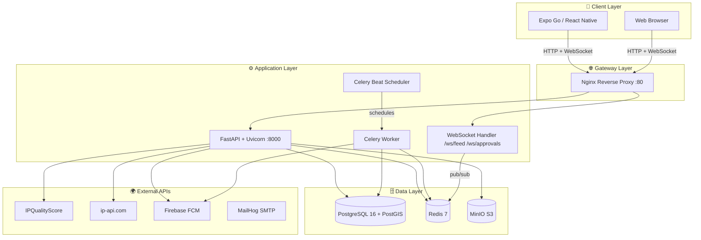
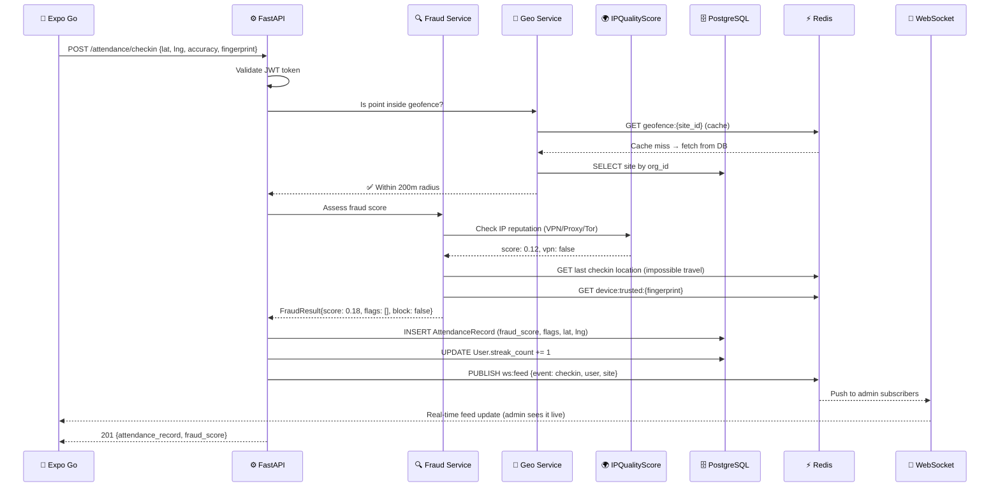
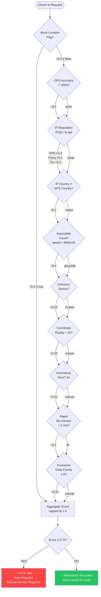
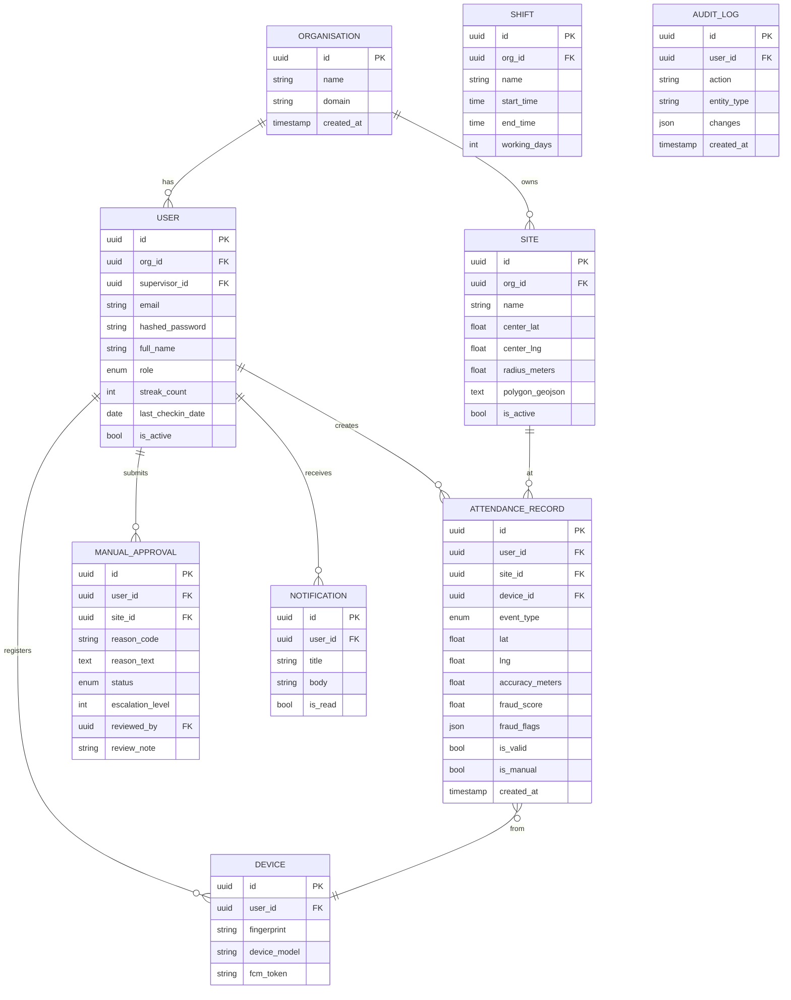
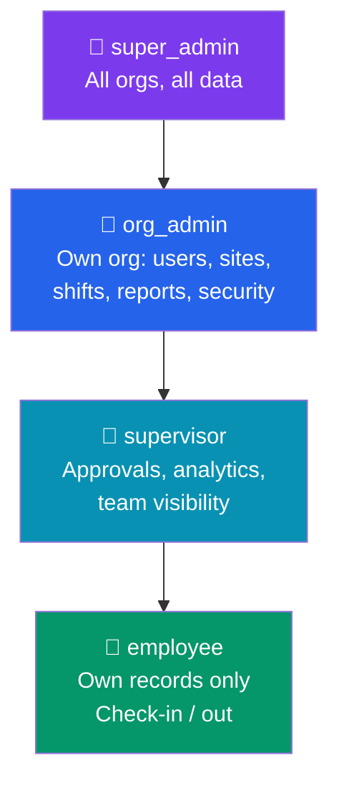
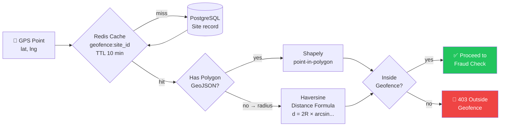
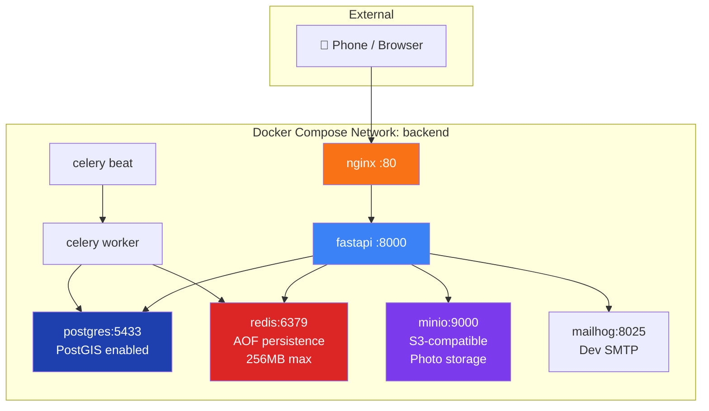

# System Architecture — Geo-Location Based Attendance

## 1. High-Level System Overview



---

## 2. Request Flow — Check-In



---

## 3. Fraud Detection Pipeline



---

## 4. Database Schema (ERD)



---

## 5. Real-Time WebSocket Architecture

```mermaid
graph LR
    subgraph Triggers["Event Triggers"]
        CI[Check-In API]
        BPA[Buddy Punch\nAnalysis Task]
        GW[Geofence Watch\nTask]
        ESC[Escalation Task]
    end

    subgraph Redis["⚡ Redis Pub/Sub"]
        FEED[Channel: ws:feed]
        APPR[Channel: ws:approvals]
    end

    subgraph WSServer["📡 WebSocket Server"]
        CM[Connection Manager\nper-channel registry]
        WF[/ws/feed]
        WA[/ws/approvals]
    end

    subgraph Clients["Clients"]
        ADMIN[Admin Dashboard\nLive Feed]
        APANEL[Admin Approvals\nPanel]
    end

    CI -->|PUBLISH| FEED
    BPA -->|PUBLISH| FEED
    GW -->|PUBLISH| FEED
    ESC -->|PUBLISH| APPR
    FEED --> WF
    APPR --> WA
    CM --> WF
    CM --> WA
    WF -->|broadcast| ADMIN
    WA -->|broadcast| APANEL
```

---

## 6. Celery Task Schedule

```mermaid
gantt
    title Background Task Schedule (repeating)
    dateFormat HH:mm
    axisFormat %H:%M

    section Every 2 min
    Geofence Breach Watch     :active, 00:00, 2m

    section Every 10 min
    Buddy Punch Analysis      :active, 00:00, 10m

    section Every Hour
    Escalation SLA Check      :active, 00:00, 60m
    Late Warning Dispatcher   :active, 00:00, 60m

    section Daily
    Redis Cache Cleanup       :active, 00:00, 1440m
    User Risk Profiler        :active, 00:00, 1440m
    Shift Pattern Detector    :active, 00:00, 1440m
```



---

## 7. Multi-Tenant Role Hierarchy



---

## 8. Geofencing Logic



---

## 9. Docker Infrastructure


